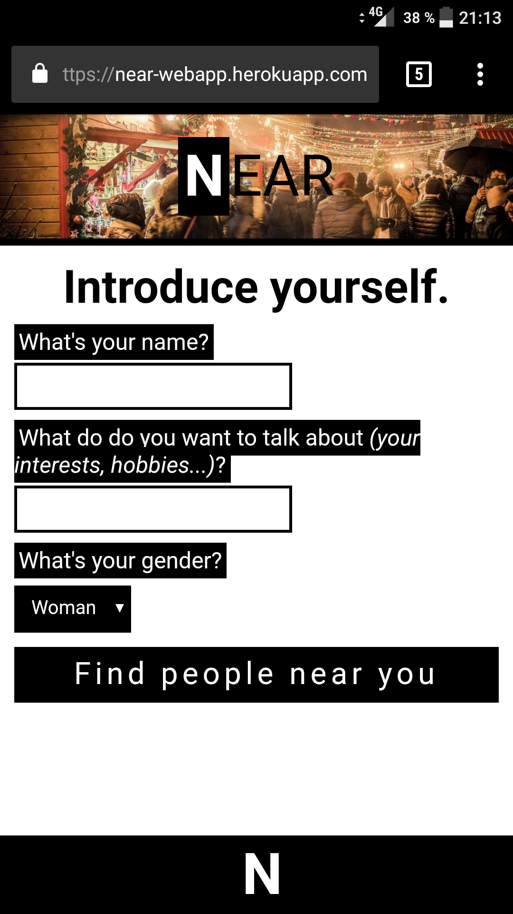
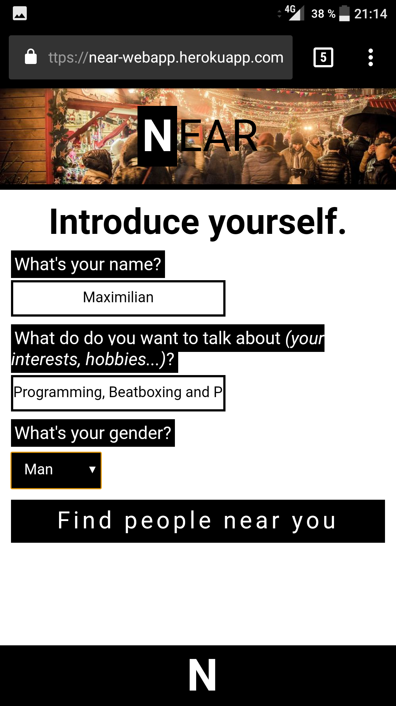
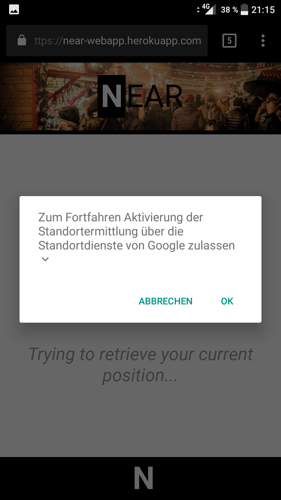
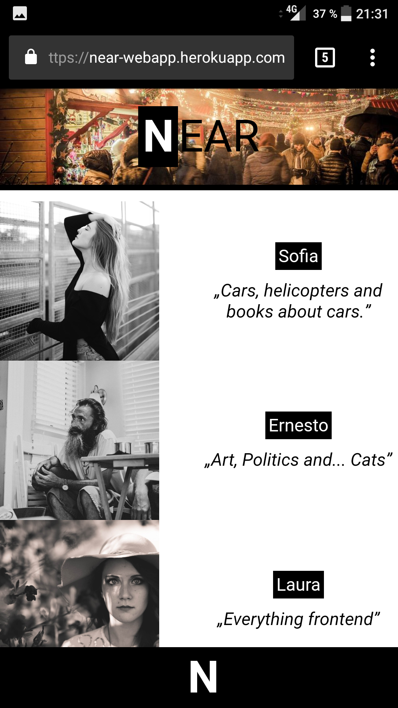
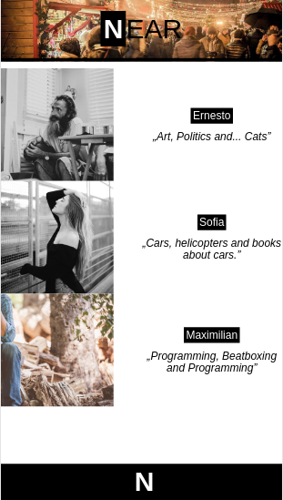
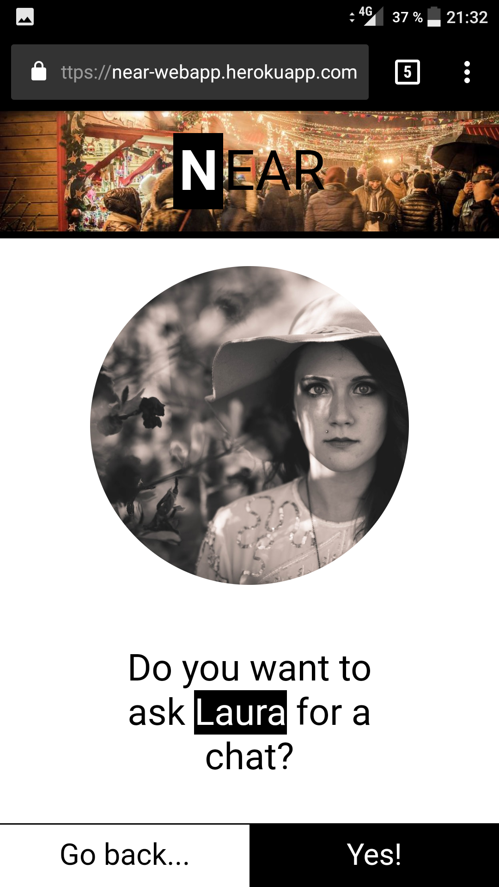
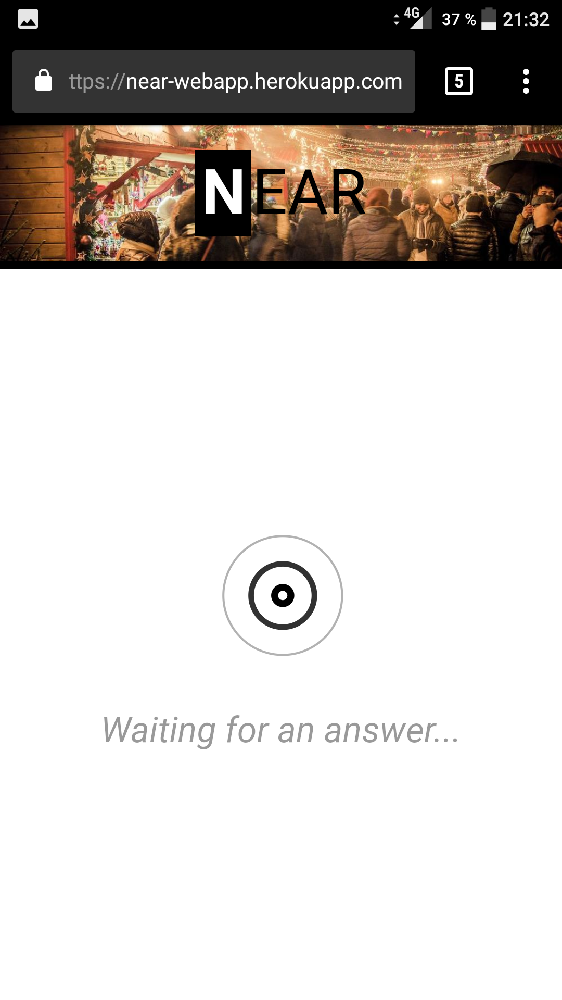
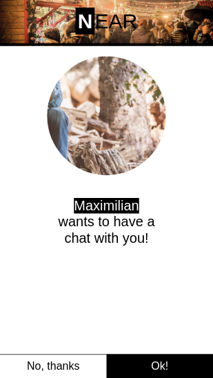
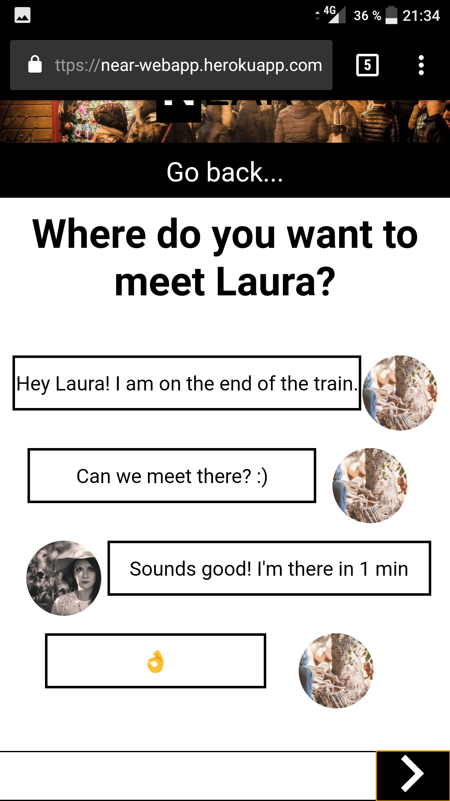

    

(This project was originally created as an application to an university)

# The problem
People often complain about the fact, that humanity in general is getting more and more unsocial because of the wide spread use of distracting smartphones, which keep us from talking to the person sitting next to us in the bus or having a chat with that interesting person in the subway during the daily way to work. And I think that this problem is indeed there. I want to help everyone to have some great conversations during the train ride, the bus ride, at the airport and so on. And I don't think that technology on its core is the problem. It's how people use it. We can use it to play satisfying games, alone, to scroll through our Twitter feed, alone. Or we could use it to come in touch with people with similar interests in a more direct and simpler way than ever. Through the correct use of technology. So I would like to use the digital world to bring people back in its physical counterpart, in a very unobtrusive and direct way. I'm particularly interested in solving this problem because as a frequent user of public transport, I face this problem very often in my everydaylife. And it would be just too nice to have an interesting chat every time I am in a bus, waiting for a train or just sitting somewhere alone. And the more you talk to people, the opener you become. So that's also a very important aspect: Using technology to create a widespread conversation culture never seen before in the real world. And the opener the people, the better the world we live in. That's why I've chosen to solve this problem.

# The solution: NEAR
The solution to this problem is an easy to use web application (with a focus on mobile devices).
## The concept
When a user wants to have a chat with someone, she simply opens up the web application in a browser and logs in. During this step, some information about the user is necessary, like the name, interests and a profile picture. After logging in, the current position of the user is used to find people nearby. Now, the user can select another user she would like to have a talk with. The selected user then receives a request, which can be accepted or denied. If accepted, the users can have a short chat in the "digital world" to agree upon a place to meet. After that, the conversation in the real, physical world can start.
## How did I come up with it?
I think that software allows us to solve problems in a way that was unimaginable before we had the possibility to create software like today. The only border is your imagination. And this problem is no exception. With a concept like this, problems can be solved in a very efficient way and maybe revolutionize this specific process. I think that there's no better solution for this problem than a technological one. Additionally, implementing the concept as a webapp makes it easyly accessible for everyone without the tedious process of installing an app. Working by default on a wide variety of devices, you can directly start talking to people.
## The implementation of a prototype
I have developed a prototype which implements most of the features described in the concept.
I deployed it for testing purpose, you can access is via this URL: https://near-webapp.herokuapp.com/
### Usage
Here I will describe how NEAR can be used to find people nearby and have a chat with them. The tutorial doesn't explain how to proceed after finding a conversation partner, as this is something the users have to do for their own.

#### Step 1: Open up the webapp by navigating to https://near-webapp.herokuapp.com/ with your favorite browser.

    

#### Step 2: Enter some information about yourself.

    

#### Step 3: Click on the button at the bottom ("Find people near you").

#### Step 4: Allow the web app to track your current GPS position, so that people near you can be detected.

    

#### Step 5: Select a person to have a chat with.

Now you can see all the people nearby using NEAR at the moment.

    

This is what other users see:

    

Let's have a talk with Laura. To ask her if she would like to have a chat, just tap the according user.

#### Step 6: Confirm (or not).

    

#### Step 7: Wait for an answer.

    

The other user needs to confirm if she would like to have a talk:

    

#### Step 8: After the other user accepted your request, agree upon a place to meet.

    

#### Step 9: (Hopefully) Have a nice talk!

You can also test it yourself if you ask a friend to use NEAR next to you (because right now, the number of people using it is limited).

### Technologies used
For the fronted, the following technologies were used:
- React as the view library
- MobX for state management
- Babel for transpiling ESNext to browser compatible ES5
- Webpack for module bundling

For the backend, I've used those technologies:
- node.js
- MongoDB as the database (via Mongoose)
- socket.io for realtime server-client communication

As this is a prototype, there would be still some work to do to bring up a ready-for-production application, but the chosen technologies are a solid foundation for that.

Currently, I use unsplash to get the displayed profile images based upon the selected gender (as it is just a prototype).
### Missing features / roadmap
Here's a list of the missing features whose absence makes it a prototype:
- Login / Register
    - Currently, user accounts are only persisted temporarily in the database. As soon as you close the app or loose the connection, you account gets deleted. In the future, users should be able to create a permanently saved profile and also login through their social media accounts.
- Interests-categories
    - Instead of using pure text to determine what your interests are, predefined categories should be used. The user should specify at least 5 categories she or he is interested in and also specify how important this specific category is for the user from a scale of e.g. 1-5. The reason for this is quite straightforward: NEAR could match your interests with the people near you and emphasize people with similar interests.
- User-Ratings
    - At the end of a conversation, each user should be able to give the other user a rating: A number ranging from 1 (a very bad conversation partner) to 5 (an excellent conversation partner). This rating would then show up in the list of users near you. This has two key advantages: 
        1. Selecting a conversation partner is now also based on the experiences other users made with this user.
        2. It acts as an additional motivation to have nice and constructive conversations.
    
        I would say that this feature is an experimental one, as it could potentially have the opposite effect: Users feeling under pressure because of their rating/the rating becoming the highest priority, instead of having a good conversation or meeting new interesting people.

- Leveraging the full power of Progressive Web Apps (PWAs)
    - In the age of the modern web, PWAs offer a lot of functionalities, which were previously exclusively available for native apps. Those functionalities can bring the user experience of web applications to another level. Especially useful for NEAR would be:
        - Push Notifications
            - Whenever you come in an area with people who share the same interests like you do, you get notified.
            - If someone you previously had a good conversation with is nearby, you get notified.
            - ...
        - Add-to-homescreen
            - Users could add NEAR to their homescreen, making it faster accessible.
- Better desktop version
    - Currently, if you open up NEAR on a bigger screen, it doesn't use the available space efficiently and isn't very user-friendly. Although NEAR will be mainly used on smartphones, PC users should still be able to use NEAR in an user-friendly manner.

Of course there would be a wide variety possible features I didn't mention here. But from my perspective, those are the most important ones. From a technical point of view, many decisions would still have to be made, but I won't go into detail about that now.
## Is NEAR the best possible solution?
I don't know if NEAR is the best solution to this problem, but it's the best solution which came into my mind, as it is a very efficient and unobtrusive way to get in touch with people nearby. But I think the only way to really find out if NEAR is the best solution to this problem is becoming it widely spread on the world and heavily used by a huge number of people. So the journey doesn't end here.